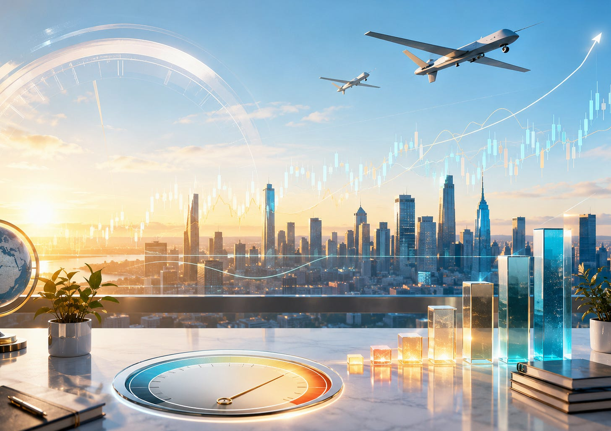
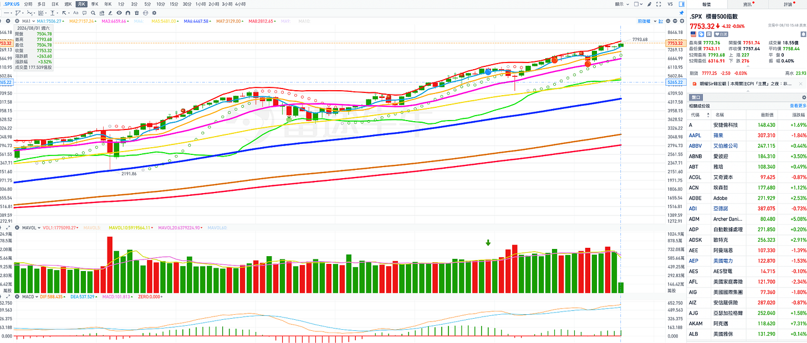
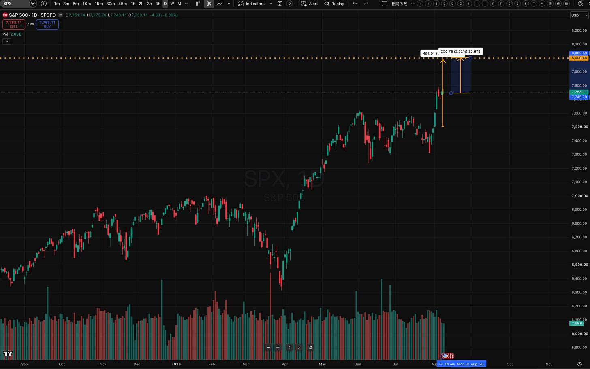
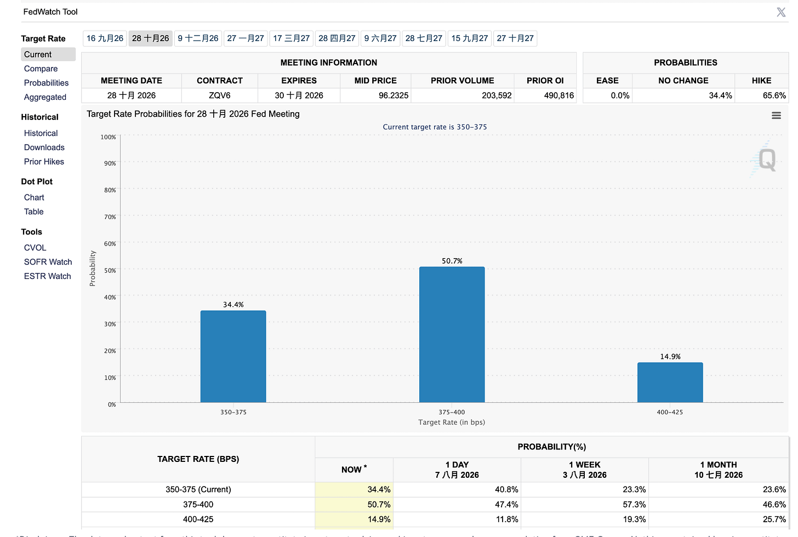
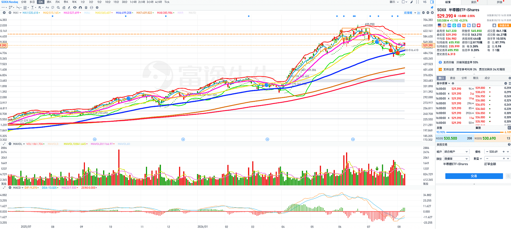
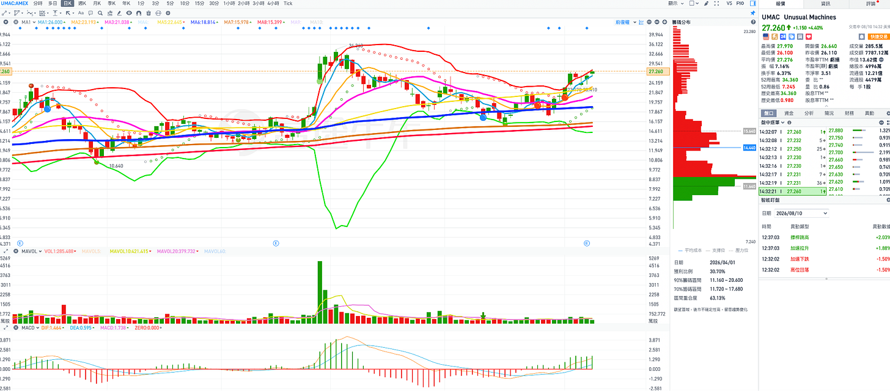
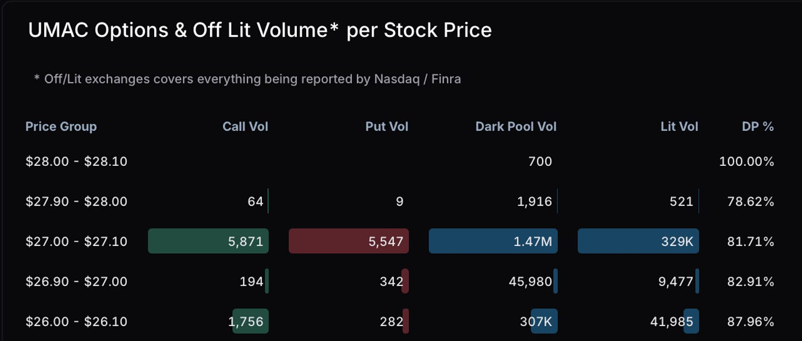
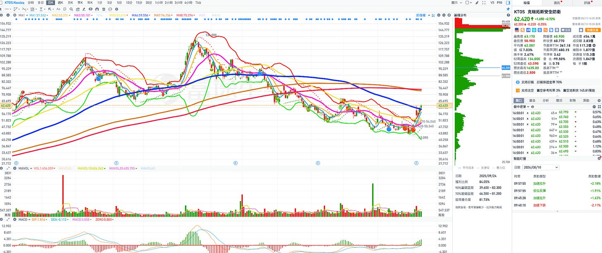
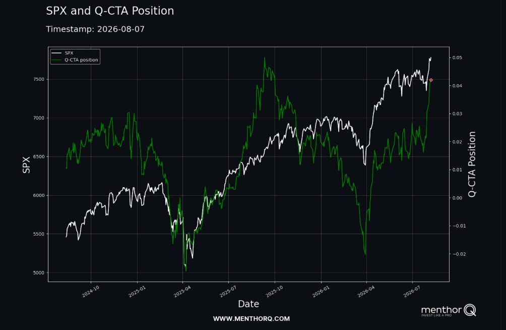
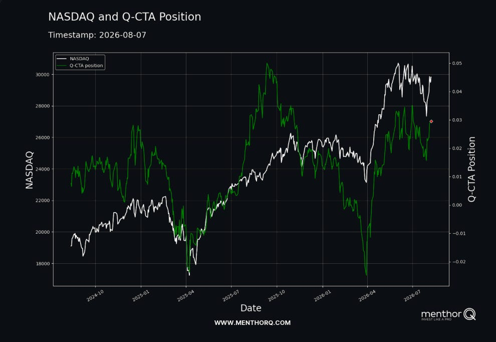

# 個股推薦：推薦兩檔國防軍工股。美股8月的 Alpha要看CPI，什麼時候小型股會發動？

**日期：** 2026-08-10
**作者：** MimiVsJames
**連結：** https://mimivsjames2.substack.com/p/8-alphacpi
**類型：** founding

---

第一部分：美股盤勢分析：

美股大盤今日小幅低開後在10:00左右開始拉升，三大指數表現分化，其中中小型股的IWM表現相對弱勢，標普跟納指偏高檔整理。

當短線大家都一片開始樂觀的時候，現在就是又回到壓盤的無聊時刻，基本上這些在之前講過，在本週長線專欄的這篇文章：2026 美股期中大選前「投資戰略」報告：參議院保衛戰與三爺政府「精準護盤」下的選前黃金窗口更仔細的說明大盤未來三個月的規劃，基本這個月會漲，但不是馬上就大漲，三爺會壓盤後然後讓他小漲續創新高，但幅度可能都不大，基本有指數或大權值股的人都無感，會覺得很無聊，今天漲這個板塊，明天拉那個板塊。

所以策略就很清楚：

1. 先找強勢板塊，但是要見黑買整理的個股

舉例來說：像是近期強勢的板塊就是軟體股，但你不要今天大漲去追，明天又去拉硬體股的時候你再來找機會買。

2. 分批佈局，不需要太擔心

你的資金有限，並且這個月會壓盤然後小幅創新高，你會無感，但是選前前三個月不是要你有感，因為選民金魚腦的人太多，所以三個月太久了，重點是要美國選民的財富幻覺大於通膨上漲率，那他們的痛苦指數就會減緩。

痛苦指數就是失業率＋通膨大家大概都聽過對吧？

非農爆冷，但人家失業率下降到4.1%了，失業率下降對於很多沒有經濟背景的人哪會知道是勞動參與率下降還是因為就業大好造成的，大象黨可以拿失業率下降出去吹就好，誰還管他那麼多，解釋起來「火就熄滅了」，所以下一個就是搞通膨。

通膨短期搞不下來，因為賽局理論告訴你：還有一個不受控的「一郎」，三爺無法控制，短期搞不下來，只能兩方面來搞，一個是週三的CPI，只要Sell-Side經濟學家估的高一點，到時候公布數據符合預期就好，管他高不高漲不漲，反正符合預期短線就會漲。

另一個就是剛剛講的「財富幻覺」，什麼意思？跟大盤有什麼關係？

反正股票漲你就覺得自己好像變有錢，是不是變有錢不重要，你就覺得今天比昨天是有錢了，所以就敢給他「開下去（花下去）」，想說到時候來賣股票就好，那你也比較會忘記油價漲幾趴，通膨CPI漲幾趴了，只要SPX或是SPY漲幅高過3%~3.5%，你就比較不痛。

所以八月的SPX理論上應該是漲3%~3.5%，我們之前給過一張圖，現在SPX漲幾趴各位猜猜看？3.52%。

SPX日線走勢圖：

如果照我們長線文章規劃的，選前兩個月拉回，最後一個月再衝，讓金魚腦選民記清楚，那選前就有可能到樂觀預測的8200點了，現在是3.52%剛好跟通膨3.5%一模一樣，讓各位回顧一下通膨CPI這幾個月的數據：

6 月 CPI 年增率是 3.5%，5 月則是 4.2%。6 月 CPI 月減 0.4%，核心 CPI 年增率為 2.6%。

重點在7月CPI 年增率:

目前市場共識是 3.4%，較 6 月的 3.5% 再降 0.1 個百分點，月增率預估是 0.1%，核心 CPI共識年增 2.5%、月增 0.2%。

有沒有很漂亮，非常漂亮，這些Sell-Side掰什麼故事都可以給你，怎麼解釋都可以，當然是朝正面來解讀。

美國政府選前想的或規劃的是一整套的東西，並且搭配貝爺和日本聯合干預日圓，並且把長債殖利率壓一壓（今天10年美債殖利率有反彈），一整套打下來就是重點就是：「護盤＋固樁」。

所以現在漲到7750就是跟通膨CPI差不多，那還沒有出現「財富幻覺」，那如果漲到8000點，哪就是代表SPX在八月漲幅接近6.4%，但不會那麼剛好，也許會拖到九月初再拉回也是有可能，因此八月漲幅有機會到4%~5%，就可以超過3.4%到3.5%。

講那麼多，大盤八月的盤勢重點應該就一個：

先壓盤，後小幅度緩步上漲盤堅。

今天JPM算是比較保守的大投行都上調目標價到8000了，後面還是會漲，但不容易選前三個月前大漲。

本週影響大盤最重要的經濟數據就是通膨數據：週三CPI，週四PPI，為什麼非常重要？

因為除了影響市場對後續「升息與降息的預期交易」以外，最重要的會影響「中小型股與科技成長股」第三季走勢。

先講結論：

如果通膨低於預期，那我們未來八月要把焦點專注在做多中小型股上。

基本上，這次CPI的預測應該會符合預期或是小於預期，因為三爺要做選舉行情不會拿石頭砸自己的腳。

今天中小型股表現弱勢，市場就是在擔心週三的CPI這個重要數據，不管財經媒體或KOL也會跟你講週三很重要，要注意、要小心，所以IWM和QQQ今天走勢都一樣，相對比SPX弱勢。

這一點要提醒各位：

如果週三公布CPI有低於預期（符合預期不見得有用），那就會把今年升息一碼的預期馬上翻轉，變成今年不會升息，並且開始可能會有「降息預期」跑出來。

再來看一遍FedWatch的預測機率：

現在市場預測（定價）到年底至少升息一碼機率是 65.6%，升息一碼的機率最高有 50.7%，完全不升息的機率則僅剩 34.4%。

這個就是Alpha所在的地方，只要市場多數認為會升息一碼，現在大盤就是沒有定價這一部分，到時候CPI有低於預期，馬上就會翻轉，首先：不升息的機率會開始超過升息一碼的機率，這時候QQQ和中小型股IWM就開始會反應上漲，如果未來還有數據像非農持續如週五這樣的數據爆冷，哪10月開始就會出現降息預期，這就搭配10月要讓金魚腦選民在股市有感的時機了。

再來看大家比較關心的費半指數：

說真的SOXX基本如果明天有守穩20MA(527），就沒有需要太擔心，今天收盤有站穩20MA，但是量增不是量縮，拉回量縮比較好，需要多觀察一天。

基本上20MA還在下彎，但已經開始從高位往低位扣抵，已經快要走平了，所以半導體個股可以找機會做多，不需要太擔心，短線需要時間的化解上方的籌碼套牢壓力，需要反覆來回換手。

半導體重要的個股特別在設備股：AMAT、TXN、KLAC、LRCX以及ONTO，短線技術面走勢跟SOXX一樣，暫時面臨20MA下彎的問題，但也都從高點往低點扣抵，大概需要10個交易日就會扣到最低點，所以還需要至少有一週的時間整理，需要等待一下，等20MA走平開始拐頭往上時，就會有較大的動能往上攻。

這一週硬體股也就是短線你可以找買點的時候。

如果對半導體有興趣的人，短線可以做多的個股可以先選TSM，因為20MA已經走平，而且拉回都守住5MA之上。

再來可以考慮TXN，因為機構大人開始進場佈局，最後可以考慮ONTO。

NVDA和AVGO還是看好，股價還有繼續往上的動能，持股續抱。只是這兩檔權值比較大，短線要等SOXX開始上攻時機會才會更大，現在都隨著大盤在壓盤時，相對也不會有比較好的表現，最多又是在這邊盤整。

像今天又是漲軟體、跌硬體的一天，要是三爺現在在壓盤，那基本就是這樣的情況，大科技權值股短線又會變無聊，今天有一、兩檔漲，其他跌，明後天又換其他權值股漲、而前一天上漲的變跌，這樣才能把指數撐住在高位並且壓盤。

SPX短線支撐與壓力

上方壓力先看 7795，短線下方第一重要支撐在7600 附近（10MA），如果SPX跌破5MA(7735）短線轉弱，但不看大跌，就回到第一支撐10MA（7600附近），最爛也有20MA(7537)支撐，所以大概會在7530~7795這一區間來回震盪後＋小幅突破，然後又震盪，階梯式小幅上漲。

只要支撐沒有明顯跌破，整體還是屬於震盪格局，但若失守7535（20MA），短線就要提高警覺，回檔幅度就會進一步擴大，這應該是八月以後的事。

雖然油價又在漲了，但大概就是這個鬼樣子，不需要太在意油價。

注意：

如果手上還有的持股記得逢高賣出，因為機構拉上來就會跑，現在油價反彈都是機構要拉來出貨用的，選前三個月應該油價還會在拉一次，像上次那樣拉高就是出貨，最近油價打到年線，但他們還沒有出完貨，所以三爺跟伊朗兩位又在那邊「話來話去」、「演來演去」，等到出完貨就不演了，資金會轉到哪邊？黃金和貴金屬，腳尾飯爸蟑螂又要蠢蠢欲動了。

第二部分：推薦兩檔可以短線與波段做多的軍工/無人機股：

UMAC：適合「短線」

這一檔可以考慮先做短線動能，這一檔相信許多人各位也有在觀察，UMAC選前現在又要來真的。

UMAC日線圖

最近軍工跟國防自主板塊（包括無人機）都有在動，過去一週 KTOS、AVAV、UMAC都在上漲。

主要是三件事：

美國國防部 11 億的 Drone Dominance 計畫

NDAA要符合美國本土國產供應鏈需求

以及2027年的高達1.5 兆的國防預算支出。

Drone Dominance 計畫目標是 2027 年前要採購超過 20 萬架無人機，目前五角大廈正在跟一批無人機公司談資金安排（包含貸款、債權融資、甚至政府直接入股），UMAC是最有機會的一家。

UMAC 這幾天在漲什麼？

主要是Q2財報：

營收 1670 萬、YoY 687%，QoQ 106%，EPS -0.16。

毛利率 34.7%，現金2.29億，員工從 Q1 底的 141 人暴增到 Q2 底 240 人，目前已超過 255 人。很明顯是在提前擴產。

短線炒作的主要敘事：「無人機供應鏈國產化自主」開始貢獻

營收開始爆發，市場要炒作先選擇看營收，不看獲利，短線炒一波上去，加上選舉行情。

Q3 是建設期，要為 9 月開始進來的 Drone Dominance 需求做準備，Drone Dominance Phase 2 的計畫中，有超過一半都是 UMAC 客戶。

所以真正營收貢獻從Q4 到 2027 年需求會快速拉升，市場現在不是在交易 Q3業績，而是提前交易Q4到明年美國「無人機供應鏈國產化自主」。

政策紅利的催化劑：

美國在美伊戰爭後加速擴大 Drone Dominance、反無人機與自主作戰採購，最近美國國防部又推出新的 Counter-UAS 採購平台，加速軍方採購反無人機的設備。

本週到八月下旬要注意的事件題材時間點：

要注意什麼？蟑螂最近不黑改又用偷的，偷什麼吹什麼，那一個短線就爆炸：吹光通就死光通、現在又開始要吹軟體股了，奇怪他們在Thread上的網軍怎麼不出來黑一下只會推薦硬體股？軟體都長上去了才在我又買了、我又賣了？偷米、擠米、大X就是同一集團，一個裝傻、一個裝兇、另一個裝好人，分飾多角真累。黑完我後就推薦大輸，也不要那麼明顯好不好？

最近又新招募一批網軍小編了，開始又是一天發數篇的AI蒸餾文廣灑策略，現在的重點就是偷、暫時先不黑了，能多少騙一點新韭菜進來。

後線就是一整個某大國網路一條龍的做法：有人偷、有人蒸餾、有人扮演好好人好形象、有人扮演黑手角色。有人偷個股、有人偷大盤和趨勢，拿去AI蒸餾就變成自己的，真的好棒棒，製作美工精美一流，內容是蒸餾。大國網路產業一條龍的精髓發揮得很透徹：一天可以生出數篇的文章，真可怕，重點是：免責聲明寫的都比重點多，並且還可以讓你練英文。

股市不好就用黑、股市開始好就來偷，最後再來一句：股票又不是只有你可以講，真的奇怪，你也不早一點講，偏偏人家寫了你才講，用偷的還想用「英雄所見略同」來包裝。

除了注意蟑螂吹當「反指」以外，更重要的是：

UMAC 接下來兩週有密集曝光的行程，這裡面有三場投資人會議，這有機會成為「短線事件交易」：

一、8/11~12 明天第 46 屆年度成長股會議

二、8/17~8/18 的 Needham 第 15 屆工業科技/機器人/電力線上一對一會議

三、8/19~8/20  Sidoti 線上會議，要與機構大人進行一對一面談。

公司選在8/6 財報公布後，連續三場路演投資人會議，等於向機構來推銷，這會有新買盤進場的機會窗口。

關注是否有透露五角大廈資金談判進度、產能擴張或新訂單的任何增量訊息，都可能被Sell-Side或是機構寫進報告、為下一波股價催化劑。

從本週到 8/20，UMAC 幾乎每隔幾天就有一個潛在的事件交易。

短線上車也要記得事件交易完成前要記得下車，最後時間節點在8/20，但是建議要搭配技術面來看。

27元這個位置站穩後，目前有倉位的人可以順勢加碼：

27 附近是很明顯的成交密集區，也就是27附近出現異常大量的機構成交。

如果股價站穩27，之後再突破28元，就可以確認27元是機構大單買盤，但你也可以看成機構提前做下週的事件交易提前進場卡位，如果後面股價往上，你就續抱，如果這幾天收盤股價跌破10MA，你就短線進場的部位先離場。

另外26元很可能機構這一波的承接區。

所以如果是短線今天收盤或夜盤要進場操作 UMAC，你就設定兩個觀察點位：

27元機構多空確認線

26元機構重要承接區

UMAC 今天非常明顯有大資金進場，目前「偏向低調吸籌」。

另一檔軍工股：KTOS，適合「波段」操作

過去的一檔中小型飆股，已經修正跌很久，籌碼面差不多清乾淨，等待突破66.8站穩後就是扭轉下跌趨勢

KTOS日線圖

先來看Q2財報的概況：本次財報業績不錯

營收 4.588 億，年增 30.5%，有機成長 19.1%，超出預期 11 ~ 12%。

EPS 0.21 大幅超過市場預期。

全年營收指引上修 17.5 ~18.1 億，在手訂單有20.8 億。

KTOS的敘事：

一、高超音速試驗平台營收翻倍

KTOS 的高超音速業務 2025 年營收 2 億，2026 年為 4 億，2027 年目標至少 7 億元，兩年翻 3.5 倍，這塊為KTOS未來最大成長的業務。

五角大廈的計畫：高超音速先進能力試驗平台（MACH-TB）

美軍要追趕中俄的高超音速武器進度，最大瓶頸不是設計、是「試射次數」。每一次試飛都要消耗一具載具加火箭發動機，而資金貴到試不起多次實驗。

KTOS就是把它的靶機複製到高超音速，提供便宜、可消耗的試飛載具和固體火箭發動機，這基本上像是耗材生意，試射越多越快，KTOS營收就越高。

2026 年的 7 億目標中，MACH-TB專案會有 4 億的撥款，美國國防部預算中預定 MACH-TB 五年金額 70 億。

所以KTOS到2028 年這塊業務可以做到 10 億美元的規模。

印第安納州的高超音速系統整合新廠已投產，先前國防部採購的 120 具固體火箭發動機從 Q3 開始交付。

二、Spartan 引擎

烏克蘭戰爭證明高價精品飛彈庫存幾週就打光，所以現代戰爭的思維已經轉向，美國國防部五角大廈現在要的是「可負擔的飛彈數量」，不是最優秀最厲害但是不多的飛彈數量。

像單價數十萬美元、可以量產數千枚的低成本巡弋飛彈，但是而這種飛彈的成本，最貴最難量產的零件就是渦輪噴射引擎。KTOS 卡的就是這個位置。

因為現在做低成本巡弋飛彈的玩家一大票（各家新創），但幾乎沒人自製引擎，不管誰的飛彈中標，引擎幾乎都要跟少數幾家買，KTOS 是產能擴最快的，它賭的是整個品類放量。

三、反無人機的需求

KTOS 本季拿下 1.6 億美元的初始合約，提供機動式定向防護系統，預期無人機未來將持續升溫，可以帶動KTOS這塊業務持續成長。

主要的邏輯敘事就是：

全世界花多少錢買無人機，就要花多少錢買反無人機的設備，用百萬美元的飛彈打幾千美元的無人機是笨蛋的虧本生意，定向能（單發的成本近乎電費）是主要的解決方法。

KTOS 做的不是像RTX或是LMT等大廠做先進武器，是做「便宜的耗材」性武器，未來KTOS的收入模式會從傳統軍工的專案轉向量產，市場還沒有預期到這部分，未來他的估值有重估向上的空間。

值得注意的是：今年流行資本支出擴張，自由現金流減少，這樣的個股市場比較不愛，但KTOS預計要燒現金8500 萬～ 1.05 億，目前股價在反彈修護估值的過程中，如果短線出現回檔，這將是背後的主要利空因素之一。

KTOS現價在62，1 月高點曾到 134，股價等於腰斬後反彈到一半的位置，現在基本面在加速，波段追KTOS的風險回報比還適合，並不會太高。

結論：

這些中小型股都在等週三，所以UMAC或是KTOS你也可以等週三CPI數據公布後再考慮要不要買。

如果CPI出來符合或低於預期（最好是低於預期），你就可以放心持有並加碼，到時候中小型股就會開始再度發動，週三CPI 數據這個數據，會奠定未來一個月的主流走勢，到時候有可能壓盤就是壓大權值科技股，然後資金轉往炒中小，之後等到九月全部來個回檔修正後，等待十月全部開始反攻拉抬，那時候資金就要回到大科技權值股了，因為只有拉抬權值股，指數就會用噴的向上攻，到時候金魚腦選民就會比較有感了。

最後給各位看兩張圖，CTA都在買什麼？

基本都在買，但是你比就知道了，不需要多加分析和解釋：要知道邏輯就去複習長線專欄本週出的文章就知道邏輯了：

2026 美股期中大選前「投資戰略」報告：參議院保衛戰與三爺政府「精準護盤」下的選前黃金窗口

綠色線就是CTA買進的資料。