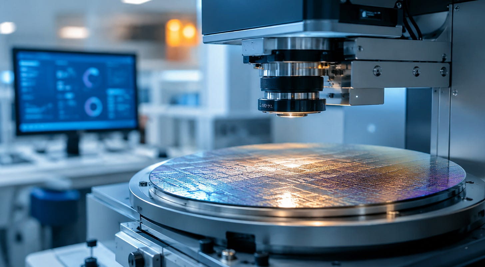
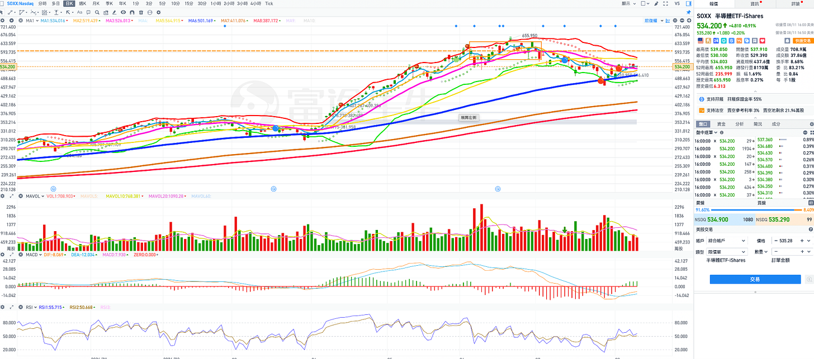
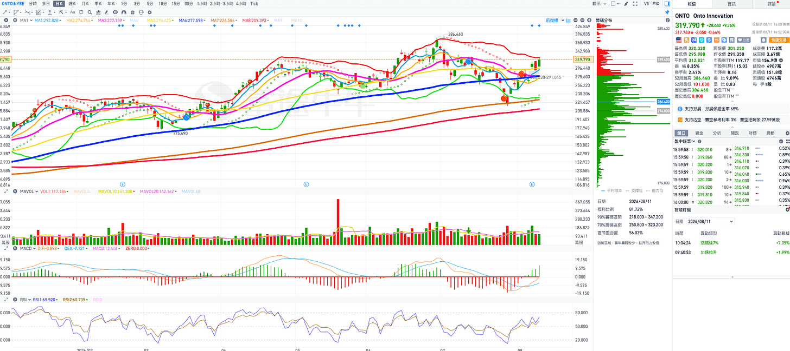
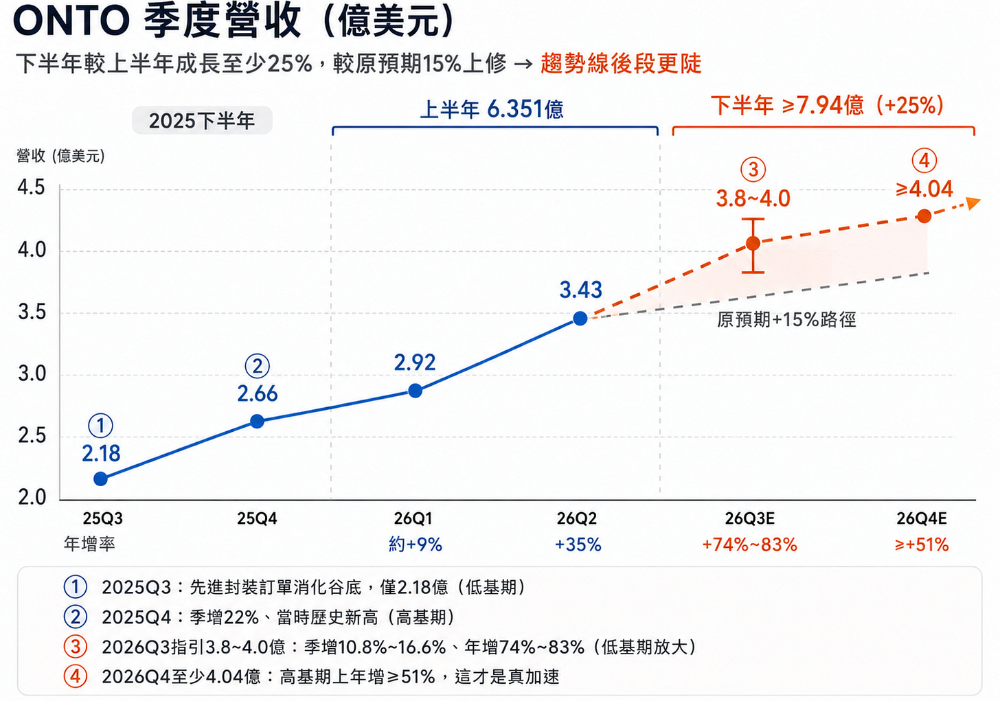

# 個股推薦：這檔半導體設備股財報後，會更想加碼？下半年會比上半年好，明年會比今年更好更加速（深度會員）

**日期：** 2026-08-11
**作者：** MimiVsJames
**連結：** https://mimivsjames2.substack.com/p/f60
**類型：** founding

---

前言：

今天大盤很沉悶，不上不下，漲跌幅都不大，SPX和QQQ小幅下跌，IWM小幅上漲，加上DIA道指這三個漲跌幅都差不多，重點都在等明天的CPI，短線沒有太多需要說明的地方，昨天深度會員的文章都已經明確提示，最近的時間點就是先看明天CPI，然後等下週費半技術面整理完畢後，硬體股也許就有比較大的機會上漲。

因此把焦點放在個股上，今天針對過去幾檔明星推薦股的財報來簡單分析，重點不多因為市場漲跌的因子在於期中大選，目前就是壓盤緩漲的階段，要比較有耐心，短線操作的週期時間可以把眼光放長一點看到九月初，如果原本就是做幾天到一兩周的這種模式，可能會比較沒明顯趨勢性。

今天推薦一檔股票：ONTO：

結論先講：

財報非常好，各位可以找機會加碼，如果空手的人可以找機會進場/再度進場，目前日線TD高7，所以保守的人可以等待高9之後買進，如果想要先趁大盤在盤整無聊時先建立倉位，這個地方就可以進場，先買進一半。

短線等8/13 AMAT財報後再考慮加碼。中長線可以等年底一個重要的時間點（最後會提到）。

推薦主軸如同標題寫的：財報後，驗證基本面會越來越好，股價還沒有反應下半年的基本面

ONTO 公布的Q2營收、毛利率與EPS全面超越市場預期並創下歷史新高，公司也大幅上調 2026 下半年的營收與獲利指引，AI 晶片帶動的先進封裝強勁需求這一趨勢沒有改變，還在加速中。所以基本面問題不大，接下來就是什麼時候會發動的時機，有機會下週費半SOXX整理完後（看20MA走平，會算扣抵的就可以先算扣抵何時扣到相對低位就知道），SOXX指數就有機會開始發動。

SOXX日線走勢圖：

財報重點（看看就好）

營收 3.431 億，年增 35.3%、季增 18%，高於預期的 3.25 億，創單季歷史新高。

EPS： 1.93 美，高於共識的 1.69元，多出 0.24元。

毛利率提升至 57%，季增 130 個基點，營業利益率30%。

訂單積壓： 11 億創歷史新高，其中30%～40% 排單至 2027 年，未來業績可見度相當高。

現金與短期投資總額增至 19 億。

Q3 指引：

營收直接跳到3.8～4億，EPS 2.18～2.38元，下半年相較上半年的營收成長，從原本15% 上修為 至少 25%起跳，並且Q4 營收還會高於 Q3。

所以基本就是Q2 很好、Q3 加速、Q4 還要再加速，逐季向上，這種個股就要跟AEHR一樣，當成你波段硬體股的主力，股價有回檔目前又站上所有均線之上，所以要把握波段目前最後進場的機會，我們波段不看太遠，最多看到今年下半年年底就可以，目前看起來基本面是逐季向上並加速。

ONTO日線走勢圖：

如果要看個股報告的話，以前的ONTO報告可以翻出來看：

個股推薦：AMD 財報盤後大跌，但聰明錢正瞄準這兩檔「 CoWoS 隱形冠軍」的彩蛋股

還有其他的文章，各位用搜尋的方式就可以找到

影響ONTO股價三個最重要因子

一、先進封裝訂單動能與在手訂單

2026 全年先進封裝成長預期從原本的 50% 上修到約 80%，在手訂單超過 11億，其中 30～40% 排到 2027 年。

客戶比歷史常態更早下單鎖定設備供應，代表 HBM 廠和封測廠對自己的擴產計畫不變。只要 AI 封裝資本支出週期不斷，這個基本面趨勢就持續推股價「中長線」的走勢。

二、Dragonfly G5出貨與毛利率爬坡

 G5 今年 3 月才發表，就拿到 HBM4 量產的 2D 檢測主力訂單，並以 3Di 技術取代了原本的既有機台，這對同業（尤其CAMT）是威脅訊號。

G5 銷售佔比提高後，因為平均售價更高，在 2027 年將會支撐毛利率上升，2027～2028 年預估EPS 12 ～15元，且 ONTO 目前相對 KLAC、AMAT 等更大型製程控制同業相對股價不算太貴。

三、先進製程比重提升

先進製程 Q2 營收已經來到約 1.2億，QoQ +50%，其中 memory 佔 60%，單季 QoQ 60%；logic 也超過 40%，預估 2026先進製程的營收成長將超過 35%。

所以ONTO 不只有單押HBM，而是整個AI製造的供應鏈設備他都有受惠到。

Rubin 出貨對ONTO的影響

Rubin 世代，全面採用 HBM4 + 更大更複雜的 2.5D/CoWoS 封裝，檢測與量測強度跳升 →，所以ONTO 的設備需求就會先出現訂單，在本季的財報已經看到證據驗證。

另外矽光子相關訂單超過 5000萬元，2/ 3 會在 2027 年出貨，估這塊 2030 年可超過 5億。

重點是設備商吃的是下游硬體製造的「擴產期」，不是「出貨期」，所以ONTO 的營收會領先 Rubin 實際出貨，也就是客戶是為了 Rubin/HBM4 量產，「現在」買機台。所以Rubin 順利出貨對它有利，但之後的Rubin Ultra、下一代 HBM持續擴產，才是支撐它股價的重點。

下半年業績怎麼看

Q3（現在）：財報對於Q3的營收指引 3.8億~ 4億，遠高於市場預估的 3.51億。

EPS 指引 2.18 ~2.38 元，也大幅高於預估的 1.93。季增 13%。

Q4業績的預估概況：

上半年營收是 6.351億，Q1 為 2.92億、Q2 為 3.431億。

這次指引調高，把下半年較上半年的成長預期從原本的 15% 上修到「至少 25%」，換算下來下半年營收至少 7.94億，全年營收有14.29億以上，相較 2025 年全年的 10.053億，年增率至少有 42%，今年成長幅度大於去年。

逐季來看：

Q3 指引為 3.8億至 4億美元。以中點 3.9億計算，季增 13.7%，若落在低標 3.8億，季增約 10.8%，如果達高標 4億，季增則有 16.6%。

以年增的角度來看：

去年2025 年 Q3 為先進封裝的訂單消化谷底、營收只有 2.18億，基期偏低，因此 Q3 年增率會出現 74%~  83% 的大幅成長的數字（中間值 79%）。

公司明確表示 Q4 營收將高於 Q3，配合「下半年至少成長 25%」的承諾回推，Q4 至少 4.04億美元，季增 3.6% 以上。

2025 年 Q4 本身就是季增 22% 的歷史新高季，基期並不低，而在這樣的高基期上 Q4 2026 仍能年增至少 51%，這才是重點，所以下半年股價理論上會比上半年更強，各位要抱好這檔股票。

下半年 7.94億對比 2025 年下半年的約 4.85億，年增率至少 63.6%，遠高於上半年的 22.1%，下半年基本面有明顯加速，這就是股價基本面支撐，如果加上選舉行情，這檔股價應該會持續創新高。

2027 年才是ONTO的「業績/基本面」真正的主升段

注意這裡指的是基本面，但股價會提前在Q4反應：

ONTO的Dragonfly G5(這是對於先進封裝缺陷檢測與3D 量測設備） 和 Iris G2（薄膜光學量測設備）：

2026 年營收的貢獻有限，比較大會遞延到 2027 年，上面提到的2億的 OSAT 大單也排在 2027 年交貨。

今年下半年的高成長主要靠現有 G3 世代 Dragonfly、先進製程量測和 HBM 既有擴產在推，明年是G5 的高單價放量 ，因為高單價，所以毛利率會再往上。

如果你是比較長線看好ONTO這檔股票，不想短線跑來跑去，你就抱好。但要忍住中間的波動，比如我們講過10月有可能大盤會有波動，到時候你要注意的時機點是買進加倉不是恐慌低點賣掉。

2027基本面比2026年更強的原因：

一、2027 年不是「預期」接到訂單，而是開始要認列收入

在手訂單超過 11億美元，30% ~40% 在 2027 年交貨，所以經過計算，2027 年有3.3億~ 4.4億的收入會認列。

而且 OSAT 夥伴超過 2億美元的訂單、大多會在 2027 年交付，並且從Q3就開始跟客戶洽談 2027 年的採購協議。

ONTO目前不會受到產能限制，靠自有工廠加上亞洲代工，產能可以倍增。

等於需求＋產能都有，所以營收在2027年沒有天花板受限，只需要「如期交付」。

二、G5訂單會讓量、價、市佔同時往上

G5 管線裡有超過 15 個不同應用、橫跨超過 10 家客戶，可以在既有市場搶份額、同時也可以打進新市場的機會。

另外G5 平均售價更高，佔營收比重提升後，會在 2027 年支撐毛利率。

一旦通過認證後，換機成本極高，未來多個世代的客戶黏性會加強。2.5D 邏輯層檢測上沒有出現訂單分食。

市場過去把 HBM 檢測視為 ONTO 和 CAMT 的雙寡頭，G5 這次在 HBM 廠評比較佳，ONTO 一個月漲 26%，CAMT 下跌 15.2%，2027 年在HBM4 檢測的這塊大餅的，未來對ONTO比較有利。

三、毛利率持續上升的

Q2 毛利率 57% 已經超過公司的目標，但未來還有繼續上升的機會，2027 年毛利率會繼續看上升原因是：亞洲延伸代工廠效益持續擴大（台股主要是京鼎）、還有剛剛我們提到過的G5的售價較高，也會對毛利率進一步成長有貢獻。

2026 年的毛利擴張主要靠「省成本」，2027 年開始「賣更貴」，成本面和售價提高兩個層面的影響。

營業利潤率年初到 Q2 提升 500 個基點到 30%，如果2027 年毛利率再往上，營運槓桿會讓 EPS 成長超過營收成長，這非常重要。到時候估值也會進一步上升，估值和EPS這檔股票還有網上的空間。

四、2027 年有新增成長曲線：三條線

第一條是矽光子：

相關訂單已超過 5000萬，2/ 3會在 2027 年出貨，粗估這塊的可服務市場到 2030 年可超過 5億，CPO（共同封裝光學）是Rubin 世代在2027年以後高速傳輸的「技術面主軸」，這條線可以讓 ONTO 從「封裝檢測」再度提升到「光電整合檢測」。

第二條是面板級封裝（FOPLP）：

明年最夯的題材之一，另一個就是剛剛講的矽光子＋CPO

這是 2.5D 之後ONTO下一步豪賭，因為檢測難度更高、對 ONTO業績會更有利。

第三條是量測板塊的擴張：

ONTO 用7.1億收購 Rigaku 27% 股權，預計 2026 年下半年完成。

這個收購是技術上把 X 光量測納入，配合其他的產品線，要往 KLAC 的前段量測地盤搶進，當然KLAC不是省油的燈，技術上目前KLAC很厲害，那ONTO為何要往這一塊發展？

這三條線在 2026 年貢獻都不大，但 2027 年開始會進入放量期。

ONTO的估值

ONTO估值貴嗎？

2026 年 預估EPS：

Q1 是1.42 元、Q2 1.93 元、Q3 指引 2.18 ～ 2.38 元（用中間值 2.28元來算），Q4 依營收與利潤率來推，有機會到 2.4 ～ 2.5 元，所以2026年的EPS大概會落在 8 ～ 8.5 元。

以財報後大約在300元附近來計算，2026 年預估本益比差不多 36 倍。雖然沒有說很便宜，但設備股算還好。

以預估本益比看，像是KLAC、CAMT、NVMI 分別是 71.7 倍、43.1 倍、47.1 倍，即使不用滾動本益比還看，ONTO 在四家設備商同業中算是最便宜的，而它又是 2026 年成長最快的。

ONTO 全年營收年增至少 42%，對比 KLAC的營收成長 12%，ONTO 的 PEG 低於 1，KLAC 以 12% 成長撐 70 倍本益比，PEG 接近 6。

再看 2027 年的定價。 2027 預估EPS是每股 12 ～15 元。如果以300 元來算，對應 2027 年的本益比大概是 19 ～ 24 倍，這對一家營收成長 40%以上、毛利率還在往上、在手訂單覆蓋到明後年的公司，20 倍上下的前瞻本益比，應該不算很貴。

操作建議：

幫各位抓重點：

基本面買進這檔股票沒有太大的問題。你可以先買一部分，之後等下面的兩個時間點：

短線看本週AMAT(8/13財報），AMAT財報公布如果沒有太大問題，盤後AMAT大漲，你不需要跟人家搶這檔，各位盤後去買ONTO更好。

中線如果要抱到明年的人： 重點是12/17 月份法說（看下面），中間會有一個Q3的財報驗證，如果法說不錯，記得可以長線再加碼一次。

目標價：

用2027 年 EPS來看，會落在 12~15 元，市場只要願意給 30 倍（KLAC的六折），對應股價就是 360以上，若給到同業中位數水準，400元以上「可以期待」，往上的空間更大。

記下來下面這個日期，放在你的行事曆一週前提醒：

ONTO會在今年12/17 日會在紐約證交所辦Sell-Side的分析師大會（法說），到時候會有財務模型更新，股價應該會提前反應大漲（大盤或是半導體指數等大環境沒有破壞的情況下），因為會對2027年股價有預期定錨的重點事件。