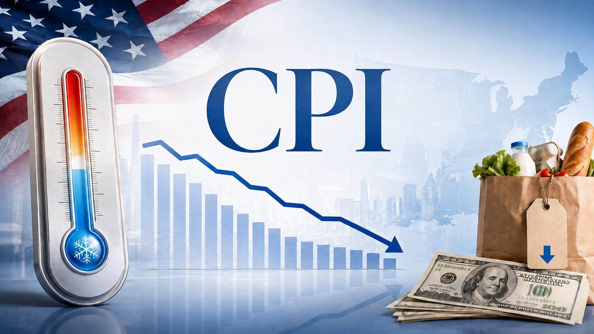
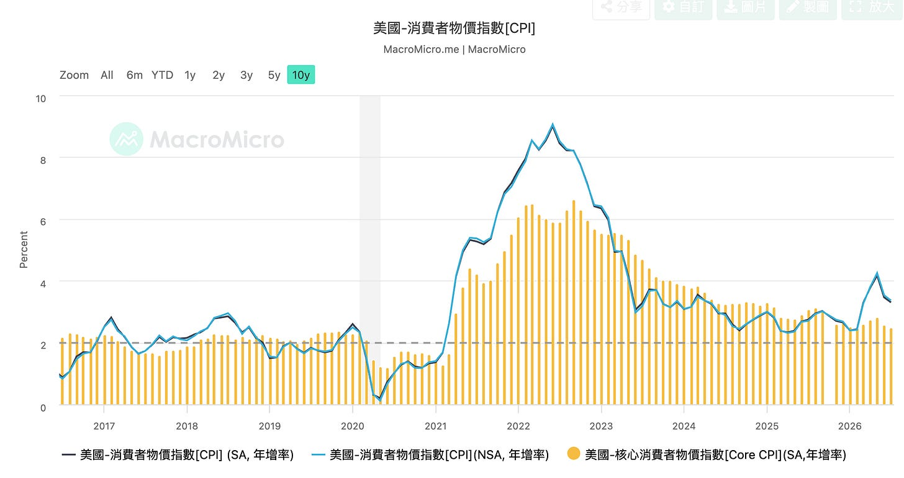
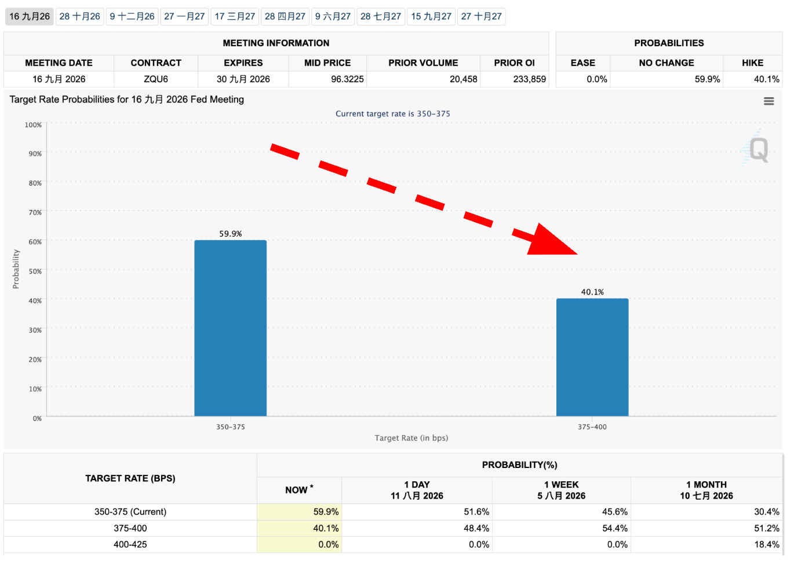
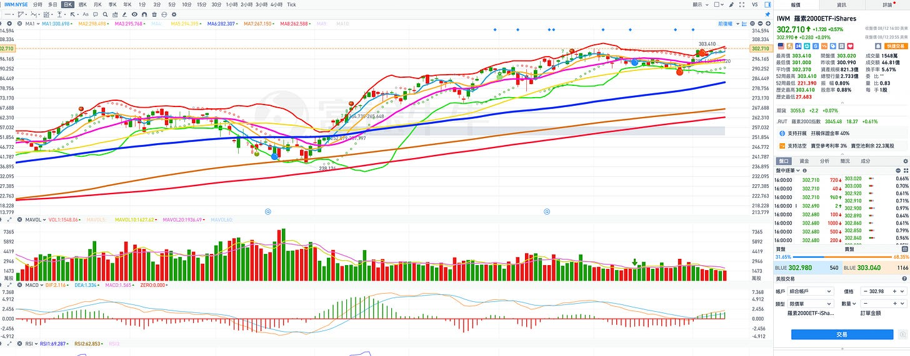
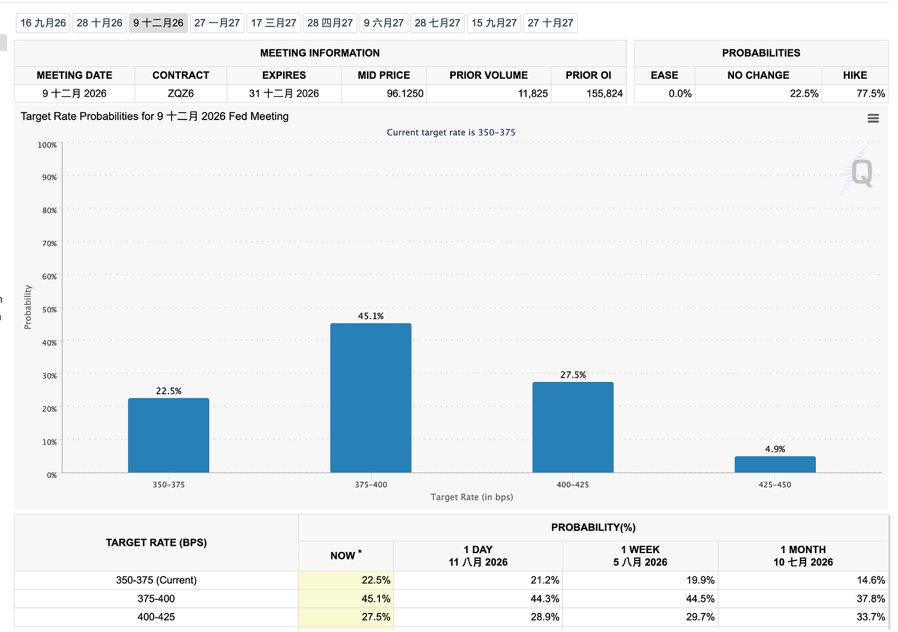
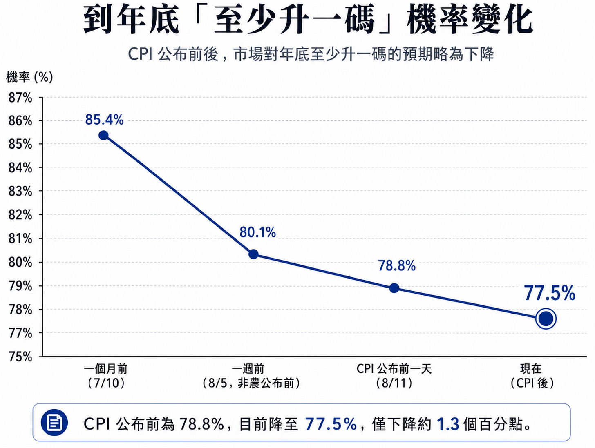
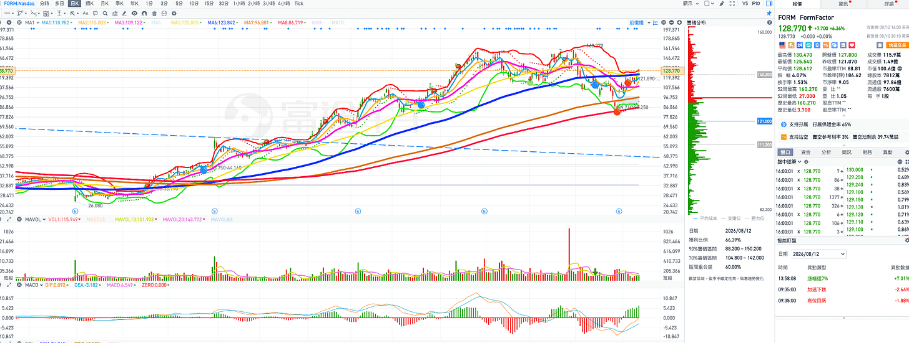
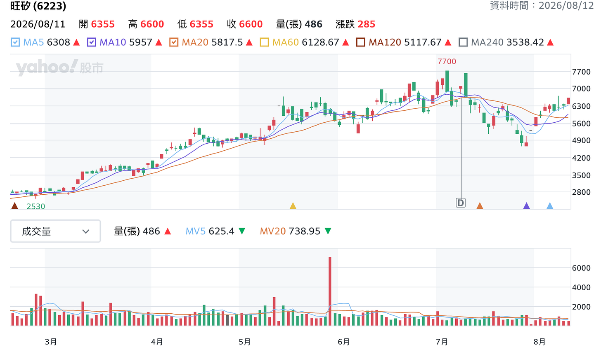
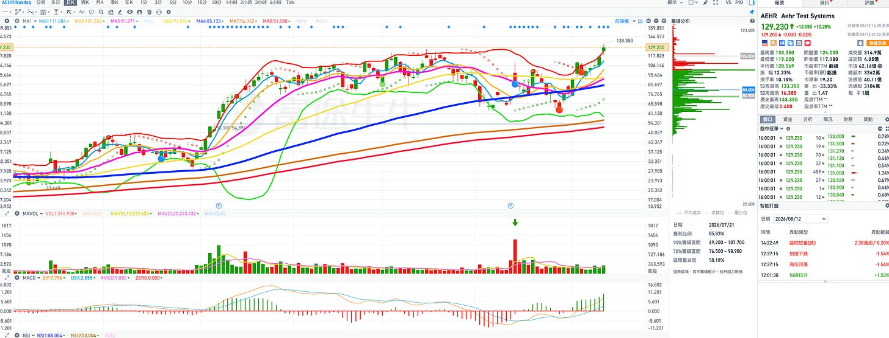

# 美國CPI降溫，升息預期開始鬆動：美股下一波真正的大行情在哪裡？美股下一場「認錯交易」正在醞釀

**日期：** 2026-08-13
**作者：** MimiVsJames
**連結：** https://mimivsjames2.substack.com/p/cpi-941
**類型：** only_paid

---

各位朋友大家好：

今天比較忙一點，所以提醒各位未來操作的一些重點，我們之前提到過，本週最重要的經濟數據就是CPI，今天公布CPI了，基本的東西簡單講一下就好，因為表面的數據不重要，重要的是背後的涵義：

重點一句話：

7 月 CPI符合預期，就是通膨「溫和」，未來利多「風險性資產」的數據，講完收工。

整體 CPI 年增由 6 月的 3.5% 降至 3.4%，核心 CPI 年增由 2.6% 降至 2.5%。

月增方面，整體 CPI 在 6 月下跌 0.4% 後，7 月僅反彈 0.1%；核心 CPI 則從 6 月持平回到 0.2%。

各位看到這數據如何解讀？其實不需要多解讀，背後的意義就是把升息的路堵死，未來有機會進一步朝降息的路邁進。

另外，BLS的頭頭明年應該可以升官了，KPI不錯。

1. 能源是壓低月通膨的主因：

7 月能源指數月減 1.5%，抵銷了住房與食品的上漲。

2. 住房壓力有明顯改善：

Shelter 月增 0.1%，且仍占本月整體 CPI 上漲約三分之二，如果租金與居住成本持續走緩，未來有助於核心通膨往2%目標靠攏。

核心 CPI 0.2% 月增2%也是符合預期：

單月增幅能長期維持約 0.2%，年化接近 2.4%，雖然離2%還有一段距離，但這一段距離未來新老闆會用不同的統計數據來替代就可以解釋掉，安啦。

一個BLS、一個沃老闆，有三爺在，好數據不是不到，只是晚一點到。

這個就是今天開始走「不升息」的交易預期：

我們講過如果CPI數據出來符合預期或低於預期，市場那時候一堆50%看九月會升息的就會認錯，這時候就會出現認錯交易，那對於利率敏感度大的中小股與科技股會最有利。

所以QQQ和IWM就走得不錯，更重要的是IWM裡面各位之前七月很痛苦的持倉，總算熬過來了，為什麼？

風險偏好回歸，升息機率下降，有利風險偏好釋放。

IWM日線走勢圖：

但進一步來看，到年底升息一碼的機率是多少？

看一下FedWatch圖會告訴你答案：

上面這張圖比較難看出來要表達什麼，用這樣的趨勢圖就知道：

說明：

升息一碼持續下降中。

但是到CPI公布，鐵齒的還是一堆，還有77.5%認為今年會升息一碼。

這代表什麼？

過去大盤的股價波動路徑，在總體經濟層面是深受「升息」這個枷鎖所限制，限制在哪邊？

大盤的「估值」。

這個升息分兩個部分來講：

愛講鬼故事的空頭Sell-Side告訴各位：九月就要升息一碼，所以大盤七月跌一波，害死神童＋韓韭。

現在九月會不會升？不會了啦，所以大盤SPX有沒有創新高？

有。

但有大漲嗎？沒有，原因就是靠EPS來推，不是靠EPS+估值來推。

所以估值還是被封印住。

但是這個封印慢慢出現裂縫，從大非農開始，到今天的CPI裂縫一點一點增加（所以才說BLS頭頭今年KPI很不錯，明年可以升官了），加上沃老闆（沃許）一直肉身擋升息，基本九月不會升息了。

所以各位看到現在已經從五五開變成六四開的機率，今天的大盤沒什麼漲，但各位的中小股開始噴，就在反應這件事，這件事我們提前預告過。

話說實在的，這個劇本早就透露了，華爾街早就寫好劇本了，各位也提早知道了，我們也提早就開始推薦股票了，今天只是驗證。

但是各位一定會問那後續呢？

看鐵齒的人多不多啊。怎麼說？

現在還有40%認為九月會升息，也不知道這些人在想什麼？沒關係，這就是多頭燃料，要挑戰三爺的意志，那就會被當七月半的鴨子來「燉補」，但是這40%其實沒有多少燃料，重點是看上面的75%那才是多頭的燃料。

為什麼？

那40%只是反應告訴你：九月不升息而已 —>這件事，但沒有告訴你今年都不升息了。

所以大盤SPX有大漲嗎？沒有，那道指有下跌的趨勢確認嗎？還沒有很確認，開始小跌但沒有做頭，因此市場大多數的人都站在年底會「升息一碼」這一邊。

那我們跟大家講過一個觀念？什麼觀念？要反市場思考

跟市場大多數人站在同一邊不見得是好的，常常會被人家拿去「當補來燉」，回想七月，一堆講記憶體好棒棒，是獲利好棒棒沒錯，但是好棒棒是人家在經營一家公司好棒棒，跟你的目的是來美股市場做股票的好棒棒又不見得一模一樣，但阿呆不知道這道理，拼命壓拼命開槓桿，想說基本面這麼好怎麼可能股價不會漲？股價沒有不會漲，只是今天漲還是兩個月後漲，另外只是一路漲還是先跌翻再漲，但天真的阿呆腦筋沒有那麼靈活，總是用「靜態分析」來想事情，永遠不是漲就是跌這兩種，不會用「動態分析」來思考，因此跌翻了洗一堆籌碼清掉後，才來漲不是嗎？

不然AEHR怎麼創歷史新高呢？像阿呆賠九位數不清一清，怎麼股市主力會拉呢？股市有太多阿呆在，主力不會覺得很煩嗎？洗一洗市場安靜一點，吵死了，整天不是在那邊曬對帳單就是在那邊吹到破皮，分明就是一日股神（像一日球迷）在那邊裝少年大神，之後七月跌翻掉，就安靜一陣子，然後一堆的就封帳號關電腦，這樣股票才會見底，未來主力才好拉，不是嗎？這永遠是不變的道理。

下一次什麼時候會出現？明年一定會看到，而且重點是：明年沒大選，三爺可以不管股市一陣子，因為沒有小辮子。這各位一定要記得，明年要是有高點拉回，可不是像今年七月殺費半然後大盤根本沒有跌這種的，之後還給你創新高，拼命護。

明年有什麼？明年什麼都沒有，也沒有大選

三爺 Put?

Fed Put?

還是驢子大人Put？

明年大概祈求驢子黨的大人不要大亂就很偷笑了，還給你低檔put 支撐？現在是三爺在當家，所以應該沒有驢子put這件事會發生。

另外三爺明年還是這兩年的三爺嗎？那也要看期中大選有沒有過關？萬一連參議院都被端了，貝哥哥的華爾街尚書大人，風會往哪邊吹還不知道....

故事講到這邊，先提醒各位，七月的痛記憶還在，各位是幸運的，因為今年還有大選，重點是今年還有期中大選不是總統大選，所以三爺會被議員大人限制住比較多，今年各位還有機會解套後賺錢跑走，萬一選完到明年高檔各位到時候已經提醒還不跑，不要再來黑我，黑我沒關係，但你這樣就意圖太明顯了，沒有在看文章只想來抄代碼和黑而已，那我就會請你出去這園地了，因為要吵出去外面吵，這個專欄是給有閱讀文章並且理性討論的地方。

短期：

八月到九月初：做中小股，AI為主。

九月「可能」會有拉回，十月會再拉。

十月下旬到十一月選前高檔震盪。

選完後看結果，整理完後走年底行情（假期＋做帳行情）。

明年一、二月高檔整理，Q1公布財報後可能就會回檔整理（這方面還不太確定，需要到時候在微調）

中長期：

明年有兩次超過7%的大盤回檔，最多會超過10%以上到15%，因為從2025對等關稅後就沒有超過15%的回檔修正了，累積的時間夠久，月線指標不管是MACD或是RSI都超買，需要找時間修正乖離過大。

現在大盤的估值是Fed的貨幣政策有關，Fed不升息：

估值就不會向下，那大盤就會靠EPS來推升指數，現在就是這樣，出現的特質就是很多時間高檔整理整理，然後慢慢緩步上升，小幅度推升創新高，這就是單靠EPS來推升，因為估值已經被封頂，指數不跌或是小漲來創新高，靠的是EPS。

如果市場開始交易「降息預期」那剛剛看到的75%就會認錯，市場會走認錯交易，第一階段會嘎空手回補或是空單回補，大多是機構的空手回補單，第二階段是打開降息預期進一步加強/強化，就會打開估值再度往上的空間，這需要總體經濟數據的配合，比如到年底的非農都一路冷，但不是經濟衰退硬著陸那種爆低，另外CPI持續下降靠近2%，讓三爺口中的那幾位票委有「政治動機」要升息的閉嘴。

這個重責大任就放在BLS頭頭的身上了，其他貝爺跟沃大爺就是跟在後面演戲就好了。

市場今年的定價已經翻轉過一次，再翻回來也很正常：

年初大家還在等降息，年中變成定價可能升息，7月時聯邦基金期貨甚至一度定價年底利率升到4%。

6月點陣圖也把原本「今年降一次」的預期抹掉，把降息推遲到2027與2028年，所以現在市場從「42%升息機率」往回退，第一站是「今年先不動」，又開始玩「你不動我就不動」的遊戲。

那從「停止升息」切到「降息預期」，需要什麼條件成立？

第一、就業趨冷或惡化要有「連續性」，不能只有一個月

7月非農只是第一槍，上次非農報告有個陷阱，失業率是因為勞動參與率下降才跟著降的，這種「假性穩定」訊號不是很確定，因為失業率還在降，BLS很辛苦，一方面要讓就業將溫但為了大選，又不能出現失業率過高，這樣就會打三爺的臉，三爺最強調的就是把工作帶回來給美國人，失業一定不能升高的，不然怎麼在選前吹這一條政績？但失業率一低，Fed又不敢降息了，因為Fed的使命是「就業」穩定，就業又沒升高，降個什麼X息啊？

很難吧～

所以呢有可能要撐到選後才會讓失業率開始上升。但沒關係，市場華爾街大人很貝哥哥，只要有鬼故事出來，就會吹，連續一兩次非農低於預期就會開始走降息預期了，不用等到真的看到失業率升高，因為那是落後指標。

薩姆規則：

三個月平均失業率比過去一年低點高出0.5個百分點，歷史上這幾乎等於衰退確認，市場會立刻搶跑定價降息交易，這個應該會發生在明年了，今年卡在11月要選舉，再怎麼樣都不敢搞到衰退，等到薩姆規則確認就太慢了。

第二個條件：看CPI先看能源端，只要荷姆茲海峽這個閥門沒打開，通膨就有再加速風險，聯準會就算看到就業轉弱也不敢鬆口，市場也不敢大幅定價降息。這就是最尷尬的地方，三爺不想打了但被一郎咬住不放，所以會不會三爺憋大招，明年選完後一次修理乾淨，反正明年又沒有要選了，這個變數很多支線，很難現在確定，因為明年要不要打能不能打要先有錢，萬一兩院都被端走，預算在國會，三爺要打也沒有什麼錢打，除非叫中東王爺再當一次笨蛋，中東王爺笨一次會笨兩次？

只要荷姆茲海峽不開放，那降息預期就會打折，因為這是一連串的傳導，最後就是傳導到CPI和利率預期。

短期11月前一郎知道三爺的軟肋是什麼，他哪會鬆手？即使要鬆手，俄羅斯也會叫他不要放鬆，不然一直把武器給烏克蘭，總是要有人拖住美國。

理論上是這樣推論，這個重責大任又回到BLS頭頭身上了，只要住房和薪資成長有下降，那核心CPI就會降，這時候華爾街有可能就會解釋通膨往下降正確的路上邁進，加上現在非農冷卻下來，今年或明年初有機會降一碼，只要玩這個遊戲就好，那風險性資產就會噴第二階段，這最快在十一月大選前可以看到，比較正常要年底到明年第一季。

未來走兩種劇本：

慢劇本：就業溫和走弱、油價回落、通膨明年初降到2字頭中段，降息預期會在今年第四季提高。

快劇本：某一次非農出現大幅負值、失業率跳升、初領失業金上升，2年期美債殖利率會先跌比較多，市場就從「觀望」翻成「定價明年降息」。歷史上每次都是市場搶跑、聯準會後追。但這個機率判斷在大選前很難出現，三爺他幹嘛拿他最愛的政績：就業，把它故意打爛，就只是為了有降息預期提早出現？

之後關注的重要經濟事件，每一次都會修正那個75%的預期，如果75%逐漸下降，股指就會續創新高：

一、每週四的初領失業金人數：

最快的就業訊號，比非農早反應。如果連續幾週往上跑，降息預期就會開始出現，這不是很容易在大選前看到。

二、9/4日要公布的8月非農：

重點不只是新增就業數字，更要看：失業率、以及上月是否又下修。連續兩個月負值就會引起降息機率開始出現。

三、8月CPI(9月中，FOMC前最後一份)，看油價反彈有沒有傳導進來。如果通膨反彈，即使就業弱，降息預期還是會被壓住。

四、8月下旬的Jackson Hole 年會：

沃大人上任後第一次在這個場合演講，通常就是對於利率政策的定調。

他成立了五個工作小組重新檢視聯準會的決策與溝通方式，並且淡化前瞻指引，結論預計年底出爐，看他在傑克森霍爾怎麼描述「就業惡化與通膨數據」間的取捨，也會決定市場會不會開始在第四季定價降息預期。

結論是什麼？

從現在到八月底盡量做多中小股與AI科技股，因為升息預期會減弱，目前第一階段升息預期減弱到不升息這一階段，中小股跌深會繼續反彈。

第二階段就是講走降息預期，這還沒有形成，如果開始走降息預期交易，那75%就會走認錯交易，75%會開始大幅降下來，不是像今天從78%降到75%這樣小幅下降，要像九月的升息一碼今天一次降10%機率，那大盤的估值就會再度被打開，這時候不只有中小股，連大科技的權值股都會持續性上漲。

這會不會配合我們前面文章提到的九月下跌、十月又再拉一波往8200點邁進？還是延後到第四季年底才發酵？目前不確定，只能時間更接近一點才會更知道，目前還沒有聽到內褲線的說法。

今天重點個股推薦：FORM

FORM日線走勢圖

本週如果有一根明確上漲的陽K線大漲，就可以進場，在還沒有看見前先關注就好。

每天關注探針三雄：

旺矽、穎崴、和精測，這三檔是FORM的領先指標。

各位別浪費掉今年黃金窗口的買進時期，九月也許會回檔，但大選前的黃金時期不要浪費掉了。

能撈盡量撈～

恭喜繼續持有AEHR的朋友，今天再度創新高，如果你要要抱波段長線一點，可以繼續持有，但是建議高點之後出現「滯漲型態」短線可以賣一半，短線來回操作降低持倉成本。

AEHR日線走勢圖：

