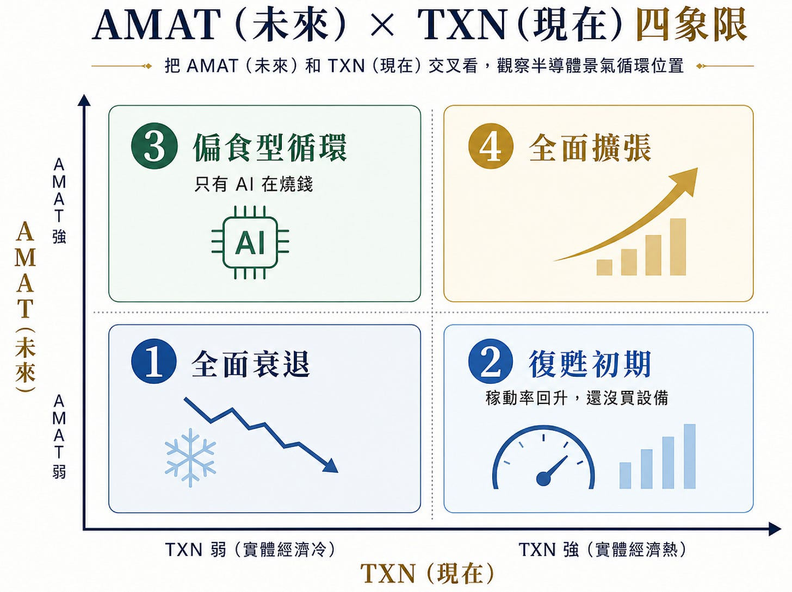
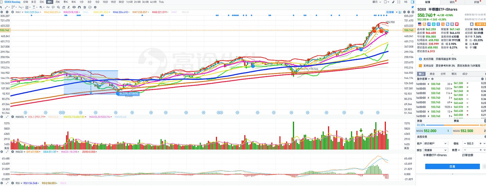
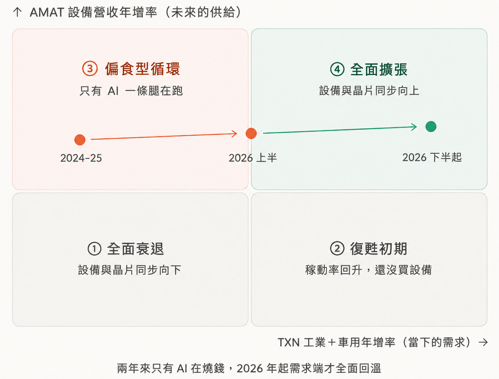
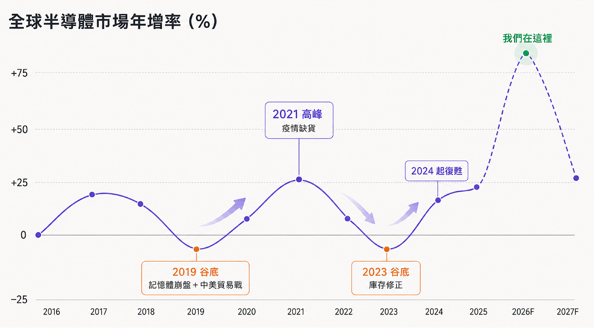
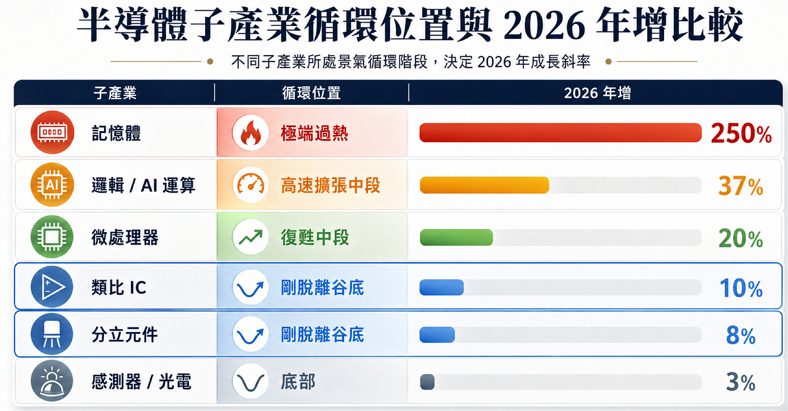
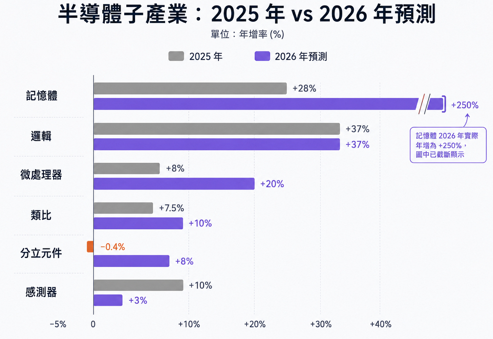
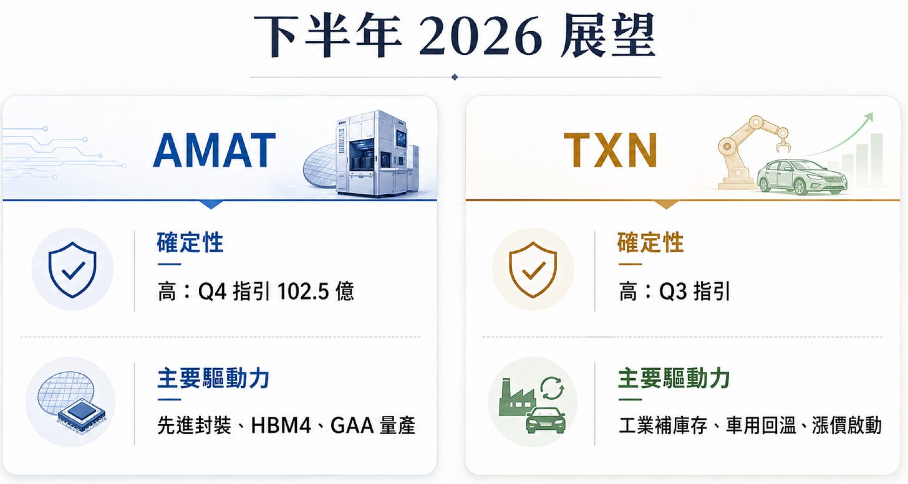
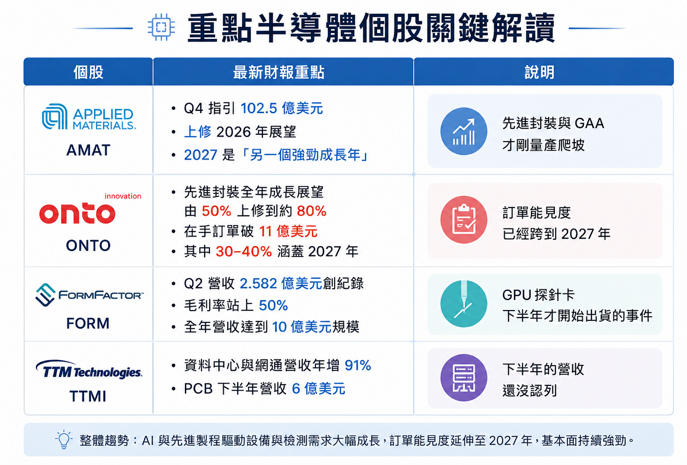
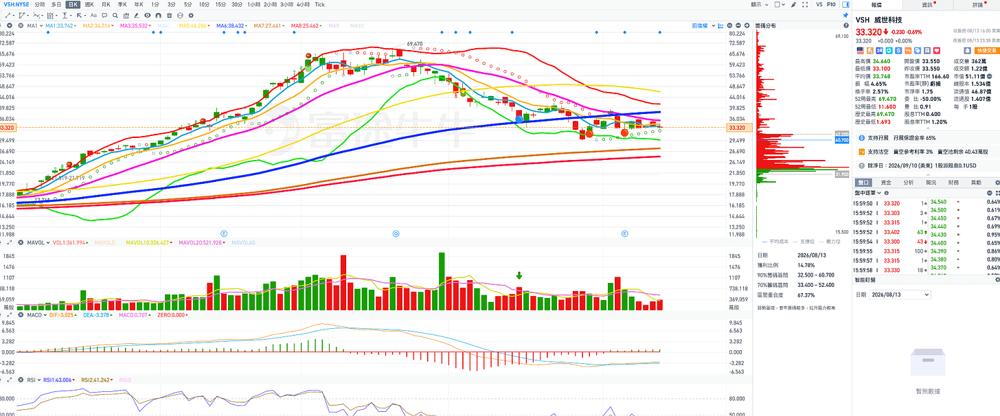

# AI硬體股大漲後，下一波資金會往哪裡走？AMAT、TXN財報給出下一輪佈局的方向（深度會員）

**日期：** 2026-08-14
**作者：** MimiVsJames
**連結：** https://mimivsjames2.substack.com/p/aiamattxn
**類型：** founding

---

今天重點一起整合來看AMAT和TXN的財報，本季這兩家財報告訴我們哪些基本面的訊號？

先說為什麼每次財報季後都要分析這兩家？

簡單講，台積電的財報，因為是全球 「AI 算力與先進製程」 的領先指標，那TXN與 AMAT就是分別代表半導體產業的週期和未來資本支出與技術規格的領先指標。

大部分人看台積電，看的是「AI 現在有多熱」，大家都知道台積電是最貼近終端的製造指標，台積電本月的營收，很粗略地來講大概就是三到六月前晶片設計公司下的單。

但半導體是一條很長的鏈，鏈上不同位置的公司，AMAT 和 TXN 剛好站在這條供應鏈上不同的位置。

AMAT 看的是「未來」：錢正在往哪裡蓋產能？蓋多久？

TXN 看的是「現在」：除了 AI 以外，半導體產業還有哪些細分很可以關注？

AMAT：跟半導體資本支出有關

AMAT 是全球營收最大的晶圓廠設備商，賣的是薄膜沉積、蝕刻、離子植入、CMP、檢測，幾乎每一道製程都需要它的設備。

晶圓廠買設備，大多是在量產前 12 到 18 個月下單，所以 AMAT 的財報會反應的一年半後這個世界會有多少產能、以及這些產能是拿來做什麼的，也就是一年半後的半導體產業的概況，現在這些廠商對於未來一年半後的景氣預估。

另外，AMAT 是唯一把「先進製程」和「成熟製程」分開講的設備商，AMAT有一塊叫做ICAPS，就是 IoT（物聯網）、Communications（通訊）、Automotive（車用）、Power（功率）、Sensors（感測器），對應的就是「成熟製程」的五大應用領域。

所以當你想知道車用半導體復甦了沒？功率元件回來了沒？可以從AMAT 的 ICAPS 來大概知道一二，也就是從設備端來找答案。

AMAT的的細分板塊有五塊：

包括先進邏輯（GAA/2 奈米）、DRAM 與 HBM、先進封裝、ICAPS 成熟製程、以及顯示器，每一塊的成長率，對應就是背後這些子板塊公司資本支出的資金流向。

TXN：半導體產業的風向指標

TXN 是 IDM廠，也就是自己設計、自己製造、自己封測，涵蓋的產品有十萬種以上，客戶有十萬家以上，製造業工廠裡的機器、每一個電源模組、電網裡的每一個轉換器，都有它生產的「類比晶片」。

因為類比晶片單價低、交期短、客戶是照著「現在」生產排程下單的，所以 TXN 的營收差不多就是等於當下半導體經濟的用量，有人把它比喻：半導體製造業 PMI（採購經理人指標）。

因為 TXN 出貨大多走代理商通路，因此它的「代理商庫存週數」和「終端出貨）」這兩個數字，是整個產業的庫存循環指標：可以知道半導體現在到底是在去庫存、補庫存、還是搶貨。

TXN的細分板塊也有五塊：

工業（工廠自動化、電網）、車用、個人電子、通訊設備、資料中心電源。

為什麼不是用ASML、ADI或是LRCX等這些當領先指標？

因為ASML 只有微影、而且是偏最先進製程，LRCX偏蝕刻沉積、主要看「記憶體」，KLAC偏製程控制、也偏先進製程。

只有 AMAT 同時走先進與成熟製程、而且把 200mm 成熟製程設備獨立揭露，所以它的財報數據是最接近「WFE」的參考指標。

另外ADI 偏工業與通訊，NXPI 偏車用，STM也偏車用，外加中國比重大，只有 TXN 的產品夠廣泛、客戶夠分散，所以TXN是最接近「類比」半導體指數的公司。

各位可以分別知道這些公司的營收比重的重心，如果要更細分的比對和驗證，比如看AMAT和TXN知道大的方向後，再把其他公司拿來對照，比如你要看車用，就再拿NXPI或是STM來分別交叉驗證，包括電話會議（法說）還有指引來看，就會更清楚。

過去在2024 ~ 2025 年，半導體產業景氣大概落在是在第三象限（AI在支撐），AMAT 一路創新高，但工業和車用寒冬，當時非AI都很慘，這應該大家都有印象。

而現在半導體產業，已經從第三象限往第四象限移動，就是AI＋非AI整個產業都在動，因此從基本面的角度上來看，SOXX拉回仍然可以波段找買點。

如果用K線走勢圖來看，看SOXX週線會更清楚：

如果我們先不考慮M4是不是繼續會資本支出燒錢前提，從周線來看，現在很明顯就是半導體產業股價的主升段，之前2022年景氣衰退，費半股價修正接近五成，在2022年10月股價落底後，開始復甦，走了接近兩年的初升段（AI帶動），到了2025/3到2026/6，開始走主升段，因為AI和非AI半導體兩個部分都開始向上動起來。

目前拉回到週線20MA就止跌，代表可能這主升段還沒有結束。

資料來源：WSTS 

說明：

一、過去十年差不多四年一次景氣循環：

2019 谷底（記憶體崩盤＋中美貿易戰）→ 2021 高峰（疫情缺貨）→ 2023 谷底（庫存修正）→ 2024 起復甦。

波峰大約 20% 到 26%，波谷 -8% 到 -12%。這個振幅是半導體產業幾十年來的常態。

WSTS 在今年 6 月預測把 2026 全年成長從原本的兩成多，一口氣上修到 90%、市場規模 1.51 兆，2027 再成長 27% 約 1.9 兆。

但記憶體年增大幅增長250%、突破 8000 億，其他部分的年增為：邏輯 37%、微處理器 20%，而類比只有 10%、分立元件 8%、感測器與光電各 3%。

把記憶體拿掉之後，類比與分立元件的成長率只有個位數到低雙位數，也就是復甦初期的概況，只有記憶體大增，而把半導體景氣扭曲掉。

對比去年2025 年來觀察，半導體各個子產業的概況：

資料來源：WSTS

說明：

一、邏輯IC 「兩年一樣」的成長率：

2025 年成長 37%，2026 年還是 37%，沒有加速，這也可以解釋為什麼 AMAT 財報再好，股價盤後還是下跌的背後原因之一，因為股價漲很大一段，市場想要看到的是「加速」，不是只有持平。

二、記憶體是「價格現象」不是循環現象

記憶體成長250% 靠的是 HBM 與 DDR 的漲價，不是出貨量翻倍。不能用這個當當成景氣指標會嚴重誤判，因為價格波動過大，含太噪音因素。

三、正在加速的有三塊，基期都很低：

微處理器：8% → 20%

類比：7.5% → 10%

分立元件：−0.4% → 8%。

分立元件出現負轉正的拐點：主要是在車用半導體。2025 年衰退的次產業中，因為車用需求疲軟，現在轉正代表車用庫存週期已經觸底開始復甦。

另外，感測器從 10% 掉到 3%，是唯一在減速的次產業，代表消費性電子與部分車用感測還沒回來。

小結：半導體景氣概況

第一、AI半導體與先進製程，持續成長

但邏輯 IC 2025 年成長 37%，2026 年還是 37%，沒有成長加速。

第二、非 AI 的半導體剛脫離谷底

微處理器從 8% 跳到 20%、類比從 7.5% 到 10%、分立元件從 −0.4% 轉為 +8%。這三塊都在加速，從低的基期開始起跳，出現「復甦」的跡象。

其中分立元件由負轉正，分立元件的主要應用就是車用與工業的功率元件，2025 年它是唯一衰退的子板塊產業，現在代表車用這個整理將近三年的庫存已經去化完畢。

成熟製程是指180 奈米到 40 奈米這個些製程，主要應用的產品就是類比 IC、功率元件、分立元件、MCU、感測器。

感測器從 10% 掉到 3%，是唯一在減速的，消費性電子與部分車用感測的需求還沒回來。

需求回來的這塊主要在「工業＋車用」：證據是TXN 工業年增 30%、車用中雙位數，VSH 被動元件B/B值到 1.4，但另一半還沒回來的是「消費性」這一塊，上面講的感測器掉到 3%，個人電子在TXN財報也只有出現季增成長。

結合景氣現況與股價，有三個重點：

一、AI 這一塊的超額報酬，股價已經反應大半：

不是說AI半導體股不能買，而是買點必須拉回買，不能靠追高，因為驅動力從「加速度」變成「持平」或減緩。

二、 非 AI 半導體這一塊的超額報酬還沒發酵完畢：

類比、功率、分立元件、被動元件這些板塊，數字剛由負轉正，股價通常領先「基本面」的數字，但估值還停在衰退期的定價。

三、成熟製程的資本支出還沒動：

成熟製成的晶片需求開始回來了，所以像是STM、ON或是聯電與世界先進等股價都大漲一波，但晶片廠現在做的是先把既有產能開好開滿，讓嫁動率提升到滿載，第二階段才是大力擴產「買新設備，這些事2027～2028年才會發生，不是今年下半年就會發生的事。

過去2021 到 2023 那一輪，成熟製程已經蓋太多了。TXN 2026 年的資本支出指引只有 20 到 30 億美元，所以現在需求爆滿，但TXN它不需要買設備，因為產能早就備好了，現在稼動率從六成拉到九成。

晶片廠大買設備的那一年，通常是設備商的好年，成熟製程設備循環會在 2027 到 2028 年啟動，代表現在要看設備商。晶片廠的投資邏輯是「需求復甦」，設備商的投資邏輯是「資本支出循環」。

接下來要關注的重點：

先進製程的資本支出是不是可以撐到 2027？成熟製程有沒有出現轉正的跡象？

工業與車用的復甦僅是單季補庫存，還是新循環的起點？未來會有機會漲價嗎？

兩家公司本季財報概況分析：

AMAT（Q3財季）：

營收 91.15 億，預期 90億，年增 25%、季增 15%。

EPS 3.5，預期 3.39元，年增 41%、季增 22%。

營運現金流也達到創紀錄 30.4 億、自由現金流 23.3 億，年增 14%。華爾街大人最愛的現金流增加敘事。

TXN（Q2）：

營收 54.6 億，預期 52.4 億，年增 23%、季增 13%。

EPS 2.14，年增 52%

毛利率 61%、營業利益率 42%

類比IC 43.7 億，年增 26%，嵌入式 7.88 億，年增 16%。

工業年增約 30%、季增 10%，車用年增中雙位數、季增高個位數，資料中心年增翻倍、季增 20%，通訊設備年、季同步增長。

Q3 財測 56.5–61.5 億、EPS 2.23～2.57。

AMAT：

AMAT  2025 全年營收是 283.7 億，光是 2026 的 Q2＋Q3＋Q4 的前三季約273 億，就快要追平去年一整年。

自由現金流從 2.1 億跳到 23.3 億，AMAT過去四季自由現金流不如預期，但本季 23.3 億、年增 14%，環比大增加。

獲利成長比營收快，具備營運槓桿

本季營收年增25%、EPS年增卻是41%。中間那 16 個百分點來自產能利用率與產品組合，不是財務操作。設備業在爬坡期會出現這種剪刀差，而且通常會持續好幾季。

財測：

Q4 指引 102.5 億，年增 51%，EPS 4.02元，年增 85%。一家年營收 300 億美元級別的營收指引單季年增 51%，這在半導體設備史上極為罕見。

大部分先進邏輯與 DRAM 晶圓廠都在滿載運轉，稼動率全面上升，包括 ICAPS 在內也看到強勁需求。

AMAT今天盤後股價下跌的原因：

中國本季佔營收 28%，一年前是 35%，中國長期是設備需求最大的單一來源，未來趨勢也是持續的。AI 的成長可以彌補中國的流失，但只剩 AI 一條腿在撐。

營收只高出預期 1.4%，EPS 高出 2.9%，而且 LRCX、KLAC 前面都交出非常強的財報之後，市場覺得超出幅度不大。

Q3毛利率來到 50.4%，但 Q4 指引仍然為 50.4%，代表Q4 營收從 91.2 億往 102.5 億跳，再增加 12%，為什麼沒有營運槓桿？

公司給出的理由是，因為需要大量增加產能，這些暫時會壓住毛利率，未來幾季還會繼續增加員工，毛利率與營業利潤率「緩步」改善甚至持平。

TXN：

營收 年增23%、EPS年增52%，毛利率 61%、營益利潤率 42%。

TXN 營益利潤率過去一度掉到三字頭出頭，現在回到 42%，代表產能利用率已經恢復原先正常水準，這個部分在 2027 年還會繼續放大。

類比IC 含電源與訊號，這部分可以吃得到AI資料中心擴張，而嵌入式是純 MCU，多用於工業與車用，目前兩者都正成長、都在加速。

Q3 指引：

營收中間值 59 億、季增 8%

TXN 上半年價格持平，現在開始對客戶漲價，Q3 開始反映，年度價格談判在 Q4 底進行、決定 2027 年的價格。

類比 IC 的漲價幾乎 100% 落入毛利，如果 2027 年漲價 2～3% 的價格，回推對毛利貢獻有150～200基點，這部分現在完全沒有反映市場預期。

未來的展望：

目前AMAT 手上訂單已經看到 2027 的能見度，2027年算是「強勁成長年」，先進封裝全年成長超過 50%、突破 20 億美元的目標。

TXN 的 2027 的展望要看Q4底的價格談判，以及工業與車用補庫存使否可以延續兩季以上。

今年 4 月的市場原本的看法還是「車用半導體要 2027 才復甦」，但是從本季最新TXN 的財報來看，車用半導體已經開始復甦，這主要由中國電動車與油電混合車所帶動，加上客戶庫存已低到相當低的水準，所以本次財報看到復甦跡象。

TXN 在上半年價格持平後開始執行漲價，另外VSH Q2 B/B值上升到 1.32（半導體 1.23、被動元件 1.4），客戶下單超過 52 週以確保產能，所以晶片端剛開始漲、被動元件端漲最兇。

誰現在強、誰下半年強、誰明年強？

一、AI 先進製程很現在很強，股價大多已反映，但應該還沒結束

AMAT 賣製程設備、ONTO 賣量測與檢測，AMAT 賣得越多，ONTO 的檢測插入次數就越多。

二、被動元件與功率元件的缺貨與漲價，這部分下半年最強，但股價也已經部分提前反映，七月出現修正

VSH 是重點標的：

它同時吃到三條線：工業年增 30.1%（智慧電網、AI 電力、高壓直流專案、工廠自動化）、車用年增 10.1%、以及 AI 電力。

VSH Q3 指引 9.45～9.75 億、毛利率接近 24%，比原先預訂「年底達成」提早了一季。

VSH 影響股價的空方因素：

因為擴產，2026 全年自由現金流預期為負，德國 12 吋廠要到 2027 年中才開始非車用量產，這一檔適合波段不適合長線。

三、成熟製程設備資本支出復甦，未來會在2027年出現，這部分還沒反映

晶片廠決定買設備機台前，會經過四個階段：稼動率填滿、交期拉長、開始漲價，最後才是買設備。

TXN 它上半年價格持平，Ｑ3才會開始跟客戶談漲價，第三季反映在財報上，另外決定明年價格的談判要到Q4季底才開始，所以漲價都還沒談完，不可能現在下單買設備。

成熟製程的設備的訂單出現是在2027 年的事，因此像AMAT 對成熟製程業務的說法還停留在「持平至小幅成長」，也就是訂單就還沒下到設備商AMAT手上。

這個階段真正會連動到的個股，除了 AMAT 本身之外，還有幾家成熟製程曝險更高的設備與零組件公司：ACMR、UCTT、ICHR、AEIS。

但這四家的特徵是成熟製程在營收的佔比高於 AMAT，所以當2027年的成熟製程資本支出出現時，對它們營收的推升幅度會更大。

操作建議：

一、有倉位者可以繼續持有，但空手需等待拉回再買的標的：

AMAT：等待到半年線480止跌才可以進場

TXN：有守住半年線才可以進場，現在還沒有止跌訊號

等拉回，因為基本面驅動力已經從「加速」轉成「維持」，追高的風險較大。

二、空手可以開始回補倉位：

VSH：被動元件、功率元件

VSH 的 B/B 值 1.32、被動元件 1.40、客戶下單超過 52 週，這些是實際訂單。

可以先建立1/3的部位，停損點設在為年線27.4以下。

三、明年成熟製程資本支出開始時更看好的標的：

ACMR、UCTT、ICHR、AEIS：除了AI基建以外，還有看2027年成熟製程的資本支出，所以現階段股價回檔了，也是適合佈局的好時機。它們這部分的基本面貢獻到 2027 年就會出現。

VSH日線走勢圖：

